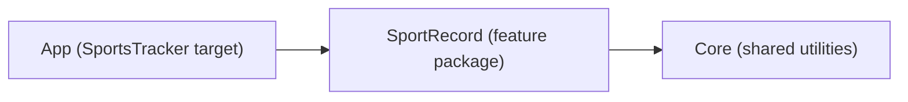

# Architecture

SwiftUI · iOS 18.6+ · Swift 6 (strict concurrency) · MVVM + Clean Architecture · local Swift packages · FactoryKit DI · SwiftData + Firebase Firestore · Swift Testing.

## Module overview



| Module | Contract |
|---|---|
| **Core** | Imports Apple frameworks only — never Firebase or SwiftData. Cross-cutting utilities: `NetworkMonitor` (+ `PathNetworkMonitor`), design-system primitives (`ContentStateView`, `MessageBanner`), `Loggers`. |
| **SportRecord** | The feature package, layered internally (Domain / Data / Presentation). Imports Core, SwiftData, FirebaseFirestore. Navigation-agnostic: screens expose callbacks, nothing more. |
| **App** | Composition root and the only place concrete types meet: `FirebaseApp.configure()`, FactoryKit registrations, `AppRouter` / `AppFlowView` / `ScreenFactory`. |

Dependencies point one way — `App → SportRecord → Core` — and are never reversed.

## Layers inside SportRecord

The dependency rule inside the feature: **Presentation → Domain ← Data**. Domain imports neither SwiftData nor Firebase; Data implements Domain's protocols; Presentation consumes Domain's use cases.

- **Domain** — `Sendable` value-type entities (`SportRecord`, `StorageType`, `ObserveRemoteRecordsError`, `SportRecordsDeleteError`), the `SportRecordRepository` protocol, and one use case per operation (`FetchLocalRecords`, `ObserveRemoteRecords`, `Save`, `Delete`), each a protocol plus a default implementation (called via `callAsFunction`).
- **Data** — per-store data sources behind protocols (`LocalSportRecordDataSource` implemented by the SwiftData `@ModelActor` source; `RemoteSportRecordDataSource` implemented by the Firestore source) and `DefaultSportRecordRepository`.
- **Presentation** — `@MainActor @Observable` ViewModels (constructor-injected, no property wrappers coupling them to DI) and thin SwiftUI views that bind and delegate.

A record's `storageType` is **not persisted** — each data source stamps it at the boundary (the local source stamps `.local`, the remote source `.remote`), so a record's origin can never drift from the store it actually lives in. The record's `UUID` is one stable identity across both stores (it doubles as the Firestore document ID).

## Folder organization — where to put what

```
Modules/SportRecord/Sources/SportRecord/
├── Domain/
│   ├── Entities/          # value-type entities + typed error/result types
│   ├── Repositories/      # repository protocols
│   └── UseCases/          # one file per use case (protocol + default implementation)
├── Data/
│   ├── DataSources/       # data-source protocols
│   │   ├── Local/         # SwiftData @Model, mapping, @ModelActor data source
│   │   └── Remote/        # Firestore DTO, mapping, data source
│   └── Repositories/      # repository implementations
├── Presentation/
│   ├── List/              # one folder per screen
│   │   ├── View/
│   │   └── ViewModel/
│   ├── AddRecord/
│   │   ├── View/
│   │   └── ViewModel/
│   ├── Localization/      # L10n.swift — typed accessor resolving keys against Bundle.module
│   └── Shared/            # presentation helpers shared across screens
├── Resources/
│   └── Localizable.xcstrings  # module's String Catalog — en source + cs/sk translations
└── Composition/           # public factory seam the app's DI container composes from

Modules/SportRecord/Tests/SportRecordTests/
├── Domain/                # tests mirror the source layout
├── Data/
├── Presentation/
└── Support/               # shared fakes & sample builders

Modules/Core/Sources/Core/
├── DesignSystem/          # ContentStateView, MessageBanner
├── Networking/            # NetworkMonitor, PathNetworkMonitor
└── Logging/               # Loggers

SportsTracker/SportsTracker/
├── DI/                    # FactoryKit Container registrations
└── Navigation/            # AppRouter, AppFlowView, ScreenFactory
```

New files go into the directory matching their layer; a new screen gets its own `Presentation/<Screen>/View|ViewModel` pair; tests mirror the source layout.

User-facing strings live only in `Presentation/`, are keyed in the catalog, and are read through `L10n`; nothing outside `Presentation/` imports `L10n`.

## Data flow

### Reads — local one-shot, remote observed live

The two stores are read through **two independent use cases**, and the ViewModel keeps their results in separate state:

- **`FetchLocalRecordsUseCase`** is a one-shot `async throws -> [SportRecord]` read of the SwiftData store, run on `load()` (and again after a save, via the sheet's `onSaved` callback). Its result is the ViewModel's `content` — `RecordsContentState` (`loading` / `loaded([SportRecord])` / `failed` — no separate empty case; `loaded([])` covers it). Local failure is the only thing that drives `failed`.
- **`ObserveRemoteRecordsUseCase`** returns an `AsyncThrowingStream<[SportRecord], Error>` backed by a live Firestore snapshot listener, driven from the view's `.task(id:)`. Each snapshot replaces the ViewModel's `remoteRecords`, so remote edits (from another device or the Firestore console) land in real time with no refetch. A stream failure is mapped to a typed `ObserveRemoteRecordsError` (`noData` / `invalidData` / `unknown`) and flips `remoteUnavailable`; a "Try again" banner action re-subscribes by toggling the `.task(id:)` trigger.

`visibleRecords` merges local + remote (sorted by `createdAt` descending) and applies the **All | Local | Remote** filter as a pure in-memory derivation — switching segments never refetches. The banner is derived from two orthogonal signals: `isOffline` (fed by `NetworkMonitor.updates`) and `remoteUnavailable`.

### Save

`SaveSportRecordUseCase` passes the new record to the repository, which routes it to the data source matching `record.storageType`. The add sheet reports success through its `onSaved` callback, which reloads the **local** store; a remote save appears on its own through the live snapshot listener.

### Delete — per-store routing, independent commits

The repository groups the records by `storageType` and runs each non-empty group's delete concurrently. Each store commits independently — one store failing does not roll back the other. Deletes are **optimistic**: the affected ids go into `pendingDeletes` and vanish from `visibleRecords` immediately. Failures surface as the **typed throw** `SportRecordsDeleteError` (Swift 6 `throws(...)`) naming exactly the failed store(s), so the ViewModel removes only the rows that were actually deleted and exposes `deleteErrors: Set<StorageType>`; the view maps that set to a store-specific alert message. A batch delete leaves edit mode immediately (selection cleared) regardless of the outcome. (The current Firestore implementation commits remote deletes offline-first and fire-and-forget, so a server-side remote failure surfaces in logs rather than through this throw.)

## Navigation

- **`AppRouter`** (`@Observable`, `@MainActor`) holds `path: [Route]` and `sheet: Sheet?`. `Route` is currently an **uninhabited enum** — the app has no push destinations yet; the first one adds an enum case plus a `navigationDestination` branch. `Sheet.addRecord(onSaved:)` is the single modal and carries the list's reload callback as an associated value.
- **`AppFlowView`** owns the app's one `NavigationStack` and the `.sheet(item:)` presentation; the records list is the stack's root view.
- **`ScreenFactory`** is the composition point: it resolves dependencies from the DI container, builds each View + ViewModel pair, and injects navigation as closures. Screens never see the router, so the feature package stays navigation-agnostic and the flow can be rewired entirely in the app target.

## Dependency injection

FactoryKit registrations live in `SportsTracker/SportsTracker/DI/Container+SportRecord.swift`:

| Dependency | Scope | Note |
|---|---|---|
| `NetworkMonitor` | `.singleton` | one shared, **stateless** gateway — each subscription to `updates` starts and cancels its own `NWPathMonitor`, scoped to the observing task |
| `ModelContainer` | `.singleton` | SwiftData container, `SportRecordModel` schema |
| `LocalSportRecordDataSource` / `RemoteSportRecordDataSource` | `.singleton` | stateless gateways, built via the package's `SportRecordStorage` composition seam |
| `SportRecordRepository` | `.singleton` | holds both data sources |
| `FetchLocalRecords` / `ObserveRemoteRecords` / `Save` / `Delete` use cases | `.cached` | stateless pass-throughs |

ViewModels are deliberately **not** container-managed: `ScreenFactory` constructs a fresh ViewModel per screen and passes dependencies through the initializer. `FirebaseApp.configure()` runs in the app's `init`, before the container is first touched.

## Concurrency (Swift 6, strict)

- All domain types are `Sendable` value types; only `Sendable` values cross concurrency boundaries.
- SwiftData's `ModelContext` is not `Sendable`, so the local data source is a `@ModelActor` — local I/O is actor-isolated off the main thread.
- ViewModels are `@MainActor @Observable`; use cases and repositories are `Sendable` and actor-agnostic.
- The delete path uses **typed throws** (`throws(SportRecordsDeleteError)`) to make the single failure mode explicit and exhaustively handled.

## Testing

Swift Testing (`import Testing`, `@Test`, `#expect`) — not XCTest.

- **Fakes over mocks:** hand-written fakes for the data sources, use cases, and `NetworkMonitor` live in `Tests/SportRecordTests/Support/Fakes.swift`.
- **Local data source** is tested against a real **in-memory `ModelContainer`** (round-trips, subset deletes, missing-id no-ops).
- **Repository** tests assert per-store routing (local one-shot `fetchLocal()`, remote `observeRemote()` stream) and the thrown `failedStores` for every local/remote delete combination.
- **ViewModel** tests cover state transitions, the local-load vs live-remote-observation split, filter behaviour (no refetch), remote-unavailability plus retry re-subscription, `deleteErrors`, and the batch-delete partial-failure matrix (including the immediate edit-mode exit).
- The remote data source is faked at its protocol (`observeRecords()` yields a stream); live Firestore — including the snapshot-listener wiring — is out of unit-test scope.

Run the suites from each package directory:

```bash
cd Modules/SportRecord
xcodebuild test -scheme SportRecord -destination 'platform=iOS Simulator,name=iPhone 16 Pro,OS=18.5'
```

```bash
cd Modules/Core
xcodebuild test -scheme Core -destination 'platform=iOS Simulator,name=iPhone 16 Pro,OS=18.5'
```
