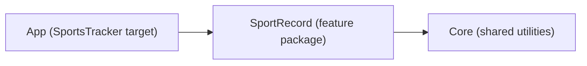

# Project Documentation Implementation Plan

> **For agentic workers:** REQUIRED SUB-SKILL: Use superpowers:subagent-driven-development (recommended) or superpowers:executing-plans to implement this plan task-by-task. Steps use checkbox (`- [ ]`) syntax for tracking.

**Goal:** Add three documentation files — `README.md`, `docs/ARCHITECTURE.md`, and `CLAUDE.md` — per `docs/superpowers/specs/2026-07-15-project-docs-design.md`. No code changes.

**Architecture:** Documentation only. README is the reviewer's front door (assignment paraphrase, requirements checklist, zero-setup quick start, HIG-grounded navigation rationale, extras); ARCHITECTURE.md is the deep dive (modules, layers, folder map, data flow, DI, concurrency, testing); CLAUDE.md is a terse operational guide for AI agents. Every command written into a document has been verified working (see Conventions); every relative link must resolve.

**Tech Stack:** Markdown (+ one mermaid diagram), xcodebuild for command verification.

---

## Conventions

- **Repo root:** `/Users/matusselecky/Documents/Work/Etnetera/sports-tracker`.
- **Verified commands** (all confirmed working on 2026-07-15, Xcode 26.6):
  - App build, from repo root — expect `** BUILD SUCCEEDED **`:
    ```bash
    xcodebuild build -project SportsTracker/SportsTracker.xcodeproj -scheme SportsTracker -destination 'generic/platform=iOS Simulator'
    ```
  - SportRecord tests, from `Modules/SportRecord` — expect a passing test run (60 tests as of today):
    ```bash
    xcodebuild test -scheme SportRecord -destination 'platform=iOS Simulator,name=iPhone 16 Pro,OS=18.5'
    ```
  - Core tests, from `Modules/Core` — expect a passing test run:
    ```bash
    xcodebuild test -scheme Core -destination 'platform=iOS Simulator,name=iPhone 16 Pro,OS=18.5'
    ```
  - Destination gotchas (documented in the README): a bare device name errors out when several simulator runtimes are installed — pin `OS=`. The **app** scheme needs an **iOS 18.6+** destination (deployment target 18.6); the packages accept iOS 18.0+. `xcrun simctl list devices available` lists what's installed.
- **Facts to state as-is** (verified against current code — do not copy stale details from the older iteration specs):
  - Repository (`SportRecordRepository`) is a **per-store gateway**: `fetchLocal()`, `fetchRemote()`, `save(_:)`, `delete(_:) throws(SportRecordsDeleteError)`.
  - **Fetch coordination lives in `DefaultFetchSportRecordsUseCase`**: `execute() -> AsyncStream<SportRecordsFetchResult>` — yields local records first (when any) for a fast first paint, then always ends with the combined, `createdAt`-descending result carrying `failedStores`.
  - `RecordsContentState` has **three** cases: `loading`, `loaded([SportRecord])`, `failed` — there is no `.empty` case (`loaded([])` covers it).
  - Storage colors: **local = blue, remote = purple** (`StorageType+Style.swift`).
  - `Route` is an uninhabited enum (no pushes yet); `Sheet.addRecord(onSaved:)` is the only modal.
  - Core contains exactly: `DesignSystem/` (`ContentStateView`, `MessageBanner`), `Networking/` (`NetworkMonitor` + `PathNetworkMonitor`), `Logging/` (`Loggers`).
- Commit per task; end commit messages with `Co-Authored-By: Claude Fable 5 <noreply@anthropic.com>`.

---

## File map

- **Create:** `README.md` (repo root), `docs/ARCHITECTURE.md`, `CLAUDE.md` (repo root).
- **Modify:** nothing else. No source, project, or config changes.

---

## Task 1: README.md

**Files:**
- Create: `README.md`

- [ ] **Step 1: Write the file**

Create `README.md` with exactly this content:

````markdown
# Sports Tracker

A SwiftUI app for recording sport performances. Each record is saved — at the user's choice — to a local database (SwiftData) or to a backend (Firebase Firestore), and the records list merges both stores into a single, filterable overview.

## The Assignment

Build a simple mobile app that records sport performances and stores them on a backend or in a local database, per the user's choice, with two screens:

1. **Add a sport record** — enter a name, a location and a duration, choose the target storage (local database or backend), and save.
2. **List sport records** — show the saved records filtered by **All | Local | Remote**, with items color-coded by storage type.

Additional constraints: design the navigation flow and justify the choice; no Storyboards or XIBs; correct behaviour in both portrait and landscape; a unified architecture across the whole project.

### Requirements checklist

| Requirement | Implementation |
|---|---|
| Name input | "Activity" section of [`AddRecordView`](Modules/SportRecord/Sources/SportRecord/Presentation/AddRecord/View/AddRecordView.swift); validation in [`AddRecordViewModel`](Modules/SportRecord/Sources/SportRecord/Presentation/AddRecord/ViewModel/AddRecordViewModel.swift) |
| Location input | same form section, same validation |
| Duration input | wheel-based [`DurationPicker`](Modules/SportRecord/Sources/SportRecord/Presentation/AddRecord/View/DurationPicker.swift) (hours / minutes / seconds) |
| Local database / backend choice | "Storage" menu picker bound to [`StorageType`](Modules/SportRecord/Sources/SportRecord/Domain/Entities/StorageType.swift) |
| Save to the chosen storage | [`SaveSportRecordUseCase`](Modules/SportRecord/Sources/SportRecord/Domain/UseCases/SaveSportRecordUseCase.swift) → [`DefaultSportRecordRepository`](Modules/SportRecord/Sources/SportRecord/Data/Repositories/DefaultSportRecordRepository.swift) routes the record by its storage type |
| List filtered by All / Local / Remote | segmented control in [`RecordsListView`](Modules/SportRecord/Sources/SportRecord/Presentation/List/View/RecordsListView.swift); pure in-memory filtering in [`RecordsListViewModel`](Modules/SportRecord/Sources/SportRecord/Presentation/List/ViewModel/RecordsListViewModel.swift) — switching segments never refetches |
| Color-coded by storage type | [`StorageType+Style`](Modules/SportRecord/Sources/SportRecord/Presentation/Shared/StorageType+Style.swift) — local records are blue, remote records purple |
| No Storyboards / XIBs | 100% SwiftUI; the app enters at [`SportsTrackerApp`](SportsTracker/SportsTracker/SportsTrackerApp.swift) |
| Portrait + landscape | adaptive SwiftUI layout (`List`, `Form`) — no orientation-specific code |
| Unified architecture | MVVM + Clean Architecture in every layer — see [docs/ARCHITECTURE.md](docs/ARCHITECTURE.md) |
| Navigation flow designed & justified | [below](#navigation-flow--and-why) |

## Getting Started

**Prerequisites:** Xcode 26+. The app targets **iOS 18.6**; the packages support iOS 18.0+. Nothing else — no accounts, keys, or setup scripts.

```bash
git clone <repo-url>
open sports-tracker/SportsTracker/SportsTracker.xcodeproj
```

Select the **SportsTracker** scheme and an iOS 18.6+ simulator, then Run.

The repository is deliberately **zero-setup**:

- the Firebase configuration (`GoogleService-Info.plist`) is committed,
- dependency versions are pinned by the committed `Package.resolved` — Swift Package Manager resolves everything on first open.

### Command line

Build the app (from the repo root):

```bash
xcodebuild build -project SportsTracker/SportsTracker.xcodeproj -scheme SportsTracker \
  -destination 'generic/platform=iOS Simulator'
```

Run the tests (each package has its own suite):

```bash
cd Modules/SportRecord
xcodebuild test -scheme SportRecord -destination 'platform=iOS Simulator,name=iPhone 16 Pro,OS=18.5'
```

```bash
cd Modules/Core
xcodebuild test -scheme Core -destination 'platform=iOS Simulator,name=iPhone 16 Pro,OS=18.5'
```

Use any installed iOS 18+ simulator (`xcrun simctl list devices available`). If several simulator runtimes are installed, keep the `OS=` qualifier — a bare device name is ambiguous and `xcodebuild` rejects it.

## Navigation Flow — and Why

The app is a single `NavigationStack` whose root is the **records list**; **adding a record is a modal sheet** presented on top of it.

- **List as home.** The user's data is the app's centre of gravity: reviewing records is the frequent action, adding one is the occasional action. Landing on the list gives immediate value on every launch — the same shape Apple's own data-collection apps (Health, Reminders, Calendar) use.
- **Add as a sheet.** Creating a record is a short, self-contained task with a clear finish-or-cancel contract — exactly what the Human Interface Guidelines recommend a sheet for (HIG: [Modality](https://developer.apple.com/design/human-interface-guidelines/modality)). The list stays visible beneath the sheet as context, and the sheet dismisses cleanly in both orientations.
- **HIG-consistent details.** `Cancel` and `Save` sit in the sheet's `.cancellationAction` / `.confirmationAction` toolbar placements and `Save` stays disabled until the form is valid; interactive dismissal is blocked only while a save is in flight. On the list, the destructive batch delete is guarded by a confirmation dialog (swipe-to-delete needs none — the gesture is its own confirmation), editing follows the standard Edit/Done pattern with a contextual bottom-bar action, and the storage filter is a segmented control switching mutually exclusive views.
- **Explicit return path.** The sheet reports success through an injected `onSaved` closure that reloads the list — a visible data-flow seam instead of hidden shared state.

The navigation infrastructure (router, flow view, screen factory) lives entirely in the app target; feature screens receive navigation as closures and never know a router exists — see [docs/ARCHITECTURE.md](docs/ARCHITECTURE.md).

## Beyond the Assignment

- **Offline awareness** — an `NWPathMonitor`-backed banner ("You're offline — showing local records").
- **Partial-failure-aware fetch** — the stores are read concurrently; one failing store never hides the other store's records, and the failure drives an in-list banner instead.
- **Local-first progressive loading** — local records paint immediately; the merged local + remote result follows.
- **Partial-failure-aware delete** — batch deletes are routed per store and commit independently; a typed error reports exactly which store failed, and only those rows are kept.
- **Pull-to-refresh** in every list state, plus an automatic refresh when the app returns to the foreground.
- **Edit mode** with multi-select and confirmed batch delete; swipe-to-delete outside edit mode.
- **Per-segment empty states** and a global "add your first activity" empty state.
- **Unit tests across all layers** (Swift Testing) — data sources run against an in-memory SwiftData container; deletes are covered by a full local/remote combination matrix.

## Project Structure

```
├── SportsTracker/              # Xcode project + app target (composition root)
│   └── SportsTracker/
│       ├── DI/                 # FactoryKit container registrations
│       └── Navigation/         # AppRouter, AppFlowView, ScreenFactory
├── Modules/
│   ├── Core/                   # shared utilities (Apple frameworks only)
│   └── SportRecord/            # the feature package (Domain / Data / Presentation)
└── docs/
    ├── ARCHITECTURE.md         # architecture deep dive
    └── superpowers/            # design specs & implementation plans (project history)
```

Further reading:

- [docs/ARCHITECTURE.md](docs/ARCHITECTURE.md) — modules, layers, folder organization, data flow, DI, concurrency, testing.
- [docs/superpowers/](docs/superpowers/) — dated specs and plans documenting how each iteration was designed and built.
````

- [ ] **Step 2: Verify every relative link resolves**

From the repo root:

```bash
grep -oE '\]\(([^)#][^)]*)\)' README.md | sed -E 's/^\]\(//; s/\)$//' | grep -v '^http' | sort -u | while read -r p; do [ -e "$p" ] && echo "OK  $p" || echo "MISSING  $p"; done
```

Expected: every line starts with `OK`. If anything prints `MISSING`, fix the link in `README.md` and re-run.

- [ ] **Step 3: Verify the documented commands verbatim**

Run each command block from the README exactly as written (the app build from repo root; each test command from its package directory). Expected: `** BUILD SUCCEEDED **` and two passing test runs. If a destination is unavailable on this machine, adjust the README command to one that works and note the change.

- [ ] **Step 4: Commit**

```bash
git add README.md
git commit -m "docs: add README with assignment coverage, setup, and navigation rationale

Co-Authored-By: Claude Fable 5 <noreply@anthropic.com>"
```

---

## Task 2: docs/ARCHITECTURE.md

**Files:**
- Create: `docs/ARCHITECTURE.md`

- [ ] **Step 1: Write the file**

Create `docs/ARCHITECTURE.md` with exactly this content:

````markdown
# Architecture

SwiftUI · iOS 18.6+ · Swift 6 (strict concurrency) · MVVM + Clean Architecture · local Swift packages · FactoryKit DI · SwiftData + Firebase Firestore · Swift Testing.

## Module overview



| Module | Contract |
|---|---|
| **Core** | Imports Apple frameworks only — never Firebase or SwiftData. Cross-cutting utilities: `NetworkMonitor` (+ `PathNetworkMonitor`), design-system primitives (`ContentStateView`, `MessageBanner`), `Loggers`. |
| **SportRecord** | The feature package, layered internally (Domain / Data / Presentation). Imports Core, SwiftData, FirebaseFirestore. Navigation-agnostic: screens expose callbacks, nothing more. |
| **App** | Composition root and the only place concrete types meet: `FirebaseApp.configure()`, FactoryKit registrations, `AppRouter` / `AppFlowView` / `ScreenFactory`. |

Dependencies point one way — `App → SportRecord → Core` — and are never reversed.

## Layers inside SportRecord

The dependency rule inside the feature: **Presentation → Domain ← Data**. Domain imports neither SwiftData nor Firebase; Data implements Domain's protocols; Presentation consumes Domain's use cases.

- **Domain** — `Sendable` value-type entities (`SportRecord`, `StorageType`, `SportRecordsFetchResult`, `SportRecordsDeleteError`), the `SportRecordRepository` protocol, and one use case per operation (`Fetch`, `Save`, `Delete`), each a protocol plus a default implementation.
- **Data** — per-store data sources behind protocols (`LocalSportRecordDataSource` implemented by the SwiftData `@ModelActor` source; `RemoteSportRecordDataSource` implemented by the Firestore source) and `DefaultSportRecordRepository`.
- **Presentation** — `@MainActor @Observable` ViewModels (constructor-injected, no property wrappers coupling them to DI) and thin SwiftUI views that bind and delegate.

A record's `storageType` is **not persisted** — each data source stamps it at the boundary (the local source stamps `.local`, the remote source `.remote`), so a record's origin can never drift from the store it actually lives in. The record's `UUID` is one stable identity across both stores (it doubles as the Firestore document ID).

## Folder organization — where to put what

```
Modules/SportRecord/Sources/SportRecord/
├── Domain/
│   ├── Entities/          # value-type entities + typed error/result types
│   ├── Repositories/      # repository protocols
│   └── UseCases/          # one file per use case (protocol + default implementation)
├── Data/
│   ├── DataSources/       # data-source protocols
│   │   ├── Local/         # SwiftData @Model, mapping, @ModelActor data source
│   │   └── Remote/        # Firestore DTO, mapping, data source
│   └── Repositories/      # repository implementations
├── Presentation/
│   ├── List/              # one folder per screen
│   │   ├── View/
│   │   └── ViewModel/
│   ├── AddRecord/
│   │   ├── View/
│   │   └── ViewModel/
│   └── Shared/            # presentation helpers shared across screens
└── Composition/           # public factory seam the app's DI container composes from

Modules/SportRecord/Tests/SportRecordTests/
├── Domain/                # tests mirror the source layout
├── Data/
├── Presentation/
└── Support/               # shared fakes & sample builders

Modules/Core/Sources/Core/
├── DesignSystem/          # ContentStateView, MessageBanner
├── Networking/            # NetworkMonitor, PathNetworkMonitor
└── Logging/               # Loggers

SportsTracker/SportsTracker/
├── DI/                    # FactoryKit Container registrations
└── Navigation/            # AppRouter, AppFlowView, ScreenFactory
```

New files go into the directory matching their layer; a new screen gets its own `Presentation/<Screen>/View|ViewModel` pair; tests mirror the source layout.

## Data flow

### Fetch — local-first, partial-failure aware

`DefaultFetchSportRecordsUseCase.execute()` returns an `AsyncStream<SportRecordsFetchResult>` and owns the multi-store coordination:

1. Both stores are read concurrently through the repository's per-store reads (`fetchLocal()` / `fetchRemote()`).
2. If local records arrive (and there are any), they are yielded immediately — the list paints without waiting for a possibly slow or offline remote.
3. The stream always ends with the combined result: both stores merged, sorted by `createdAt` descending, with every store that threw collected in `failedStores` instead of failing the whole fetch.

The ViewModel folds the stream into `RecordsContentState` (`loading` / `loaded([SportRecord])` / `failed` — no separate empty case; `loaded([])` covers it) and derives the banner from two orthogonal signals: its `isOffline` flag (fed by `NetworkMonitor.updates`) and `failedStores.contains(.remote)`. `failed` is reached only when there is nothing to show and at least one store failed. The **All | Local | Remote** filter is a pure in-memory derivation — switching segments never refetches.

### Save

`SaveSportRecordUseCase` passes the new record to the repository, which routes it to the data source matching `record.storageType`. The add sheet reports success through its `onSaved` callback, and the list reloads.

### Delete — per-store routing, independent commits

The repository groups the records by `storageType` and runs each non-empty group's delete concurrently. Each store commits independently — one store failing does not roll back the other. Failures surface as the **typed throw** `SportRecordsDeleteError` (Swift 6 `throws(...)`) naming exactly the failed store(s), so the ViewModel removes only the rows that were actually deleted, keeps the failed ones selected, and shows a store-specific message. (The current Firestore implementation commits remote deletes offline-first and fire-and-forget, so a server-side remote failure surfaces in logs rather than through this throw.)

## Navigation

- **`AppRouter`** (`@Observable`, `@MainActor`) holds `path: [Route]` and `sheet: Sheet?`. `Route` is currently an **uninhabited enum** — the app has no push destinations yet; the first one adds an enum case plus a `navigationDestination` branch. `Sheet.addRecord(onSaved:)` is the single modal and carries the list's reload callback as an associated value.
- **`AppFlowView`** owns the app's one `NavigationStack` and the `.sheet(item:)` presentation; the records list is the stack's root view.
- **`ScreenFactory`** is the composition point: it resolves dependencies from the DI container, builds each View + ViewModel pair, and injects navigation as closures. Screens never see the router, so the feature package stays navigation-agnostic and the flow can be rewired entirely in the app target.

## Dependency injection

FactoryKit registrations live in `SportsTracker/SportsTracker/DI/Container+SportRecord.swift`:

| Dependency | Scope | Note |
|---|---|---|
| `NetworkMonitor` | `.singleton` | one `NWPathMonitor` for the app's life |
| `ModelContainer` | `.singleton` | SwiftData container, `SportRecordModel` schema |
| `LocalSportRecordDataSource` / `RemoteSportRecordDataSource` | `.singleton` | stateless gateways, built via the package's `SportRecordStorage` composition seam |
| `SportRecordRepository` | `.singleton` | holds both data sources |
| `Fetch` / `Save` / `Delete` use cases | `.cached` | stateless pass-throughs |

ViewModels are deliberately **not** container-managed: `ScreenFactory` constructs a fresh ViewModel per screen and passes dependencies through the initializer. `FirebaseApp.configure()` runs in the app's `init`, before the container is first touched.

## Concurrency (Swift 6, strict)

- All domain types are `Sendable` value types; only `Sendable` values cross concurrency boundaries.
- SwiftData's `ModelContext` is not `Sendable`, so the local data source is a `@ModelActor` — local I/O is actor-isolated off the main thread.
- ViewModels are `@MainActor @Observable`; use cases and repositories are `Sendable` and actor-agnostic.
- The delete path uses **typed throws** (`throws(SportRecordsDeleteError)`) to make the single failure mode explicit and exhaustively handled.

## Testing

Swift Testing (`import Testing`, `@Test`, `#expect`) — not XCTest.

- **Fakes over mocks:** hand-written fakes for the data sources, use cases, and `NetworkMonitor` live in `Tests/SportRecordTests/Support/Fakes.swift`.
- **Local data source** is tested against a real **in-memory `ModelContainer`** (round-trips, subset deletes, missing-id no-ops).
- **Repository** tests assert per-store routing and the thrown `failedStores` for every local/remote combination.
- **ViewModel** tests cover state transitions, local-first streaming (local yield before combined result), filter behaviour (no refetch), refresh keeping stale data on failure, and the full batch-delete partial-failure matrix.
- The remote data source is faked at its protocol; live Firestore is out of unit-test scope.

Run the suites from each package directory:

```bash
cd Modules/SportRecord
xcodebuild test -scheme SportRecord -destination 'platform=iOS Simulator,name=iPhone 16 Pro,OS=18.5'
```

```bash
cd Modules/Core
xcodebuild test -scheme Core -destination 'platform=iOS Simulator,name=iPhone 16 Pro,OS=18.5'
```
````

- [ ] **Step 2: Verify facts and links**

1. Link check, from the repo root:
   ```bash
   grep -oE '\]\(([^)#][^)]*)\)' docs/ARCHITECTURE.md | sed -E 's/^\]\(//; s/\)$//' | grep -v '^http' | sort -u | while read -r p; do [ -e "docs/$p" ] || [ -e "$p" ] && echo "OK  $p" || echo "MISSING  $p"; done
   ```
   Expected: no `MISSING` lines (the file currently has no relative links, so empty output is also fine).
2. Folder-tree check — every directory named in the folder-organization section exists:
   ```bash
   for d in Modules/SportRecord/Sources/SportRecord/{Domain/{Entities,Repositories,UseCases},Data/{DataSources/{Local,Remote},Repositories},Presentation/{List/{View,ViewModel},AddRecord/{View,ViewModel},Shared},Composition} Modules/SportRecord/Tests/SportRecordTests/{Domain,Data,Presentation,Support} Modules/Core/Sources/Core/{DesignSystem,Networking,Logging} SportsTracker/SportsTracker/{DI,Navigation}; do [ -d "$d" ] && echo "OK  $d" || echo "MISSING  $d"; done
   ```
   Expected: every line `OK`.

- [ ] **Step 3: Commit**

```bash
git add docs/ARCHITECTURE.md
git commit -m "docs: add architecture deep dive

Co-Authored-By: Claude Fable 5 <noreply@anthropic.com>"
```

---

## Task 3: CLAUDE.md

**Files:**
- Create: `CLAUDE.md`

- [ ] **Step 1: Write the file**

Create `CLAUDE.md` with exactly this content:

````markdown
# CLAUDE.md

Guidance for AI agents working in this repository.

## Project map

Sports Tracker — a SwiftUI iOS app recording sport performances to local storage (SwiftData) or a backend (Firebase Firestore), per record. Layout:

- `SportsTracker/` — Xcode project + app target: composition root only (`DI/` FactoryKit registrations, `Navigation/` router + screen factory, Firebase bootstrap).
- `Modules/Core` — shared utilities package; Apple frameworks only.
- `Modules/SportRecord` — the feature package, layered `Domain/` `Data/` `Presentation/`.
- `docs/` — `ARCHITECTURE.md` (deep dive) and `superpowers/` (dated design specs and implementation plans).

## Commands

Build the app (repo root; expect `** BUILD SUCCEEDED **`):

```bash
xcodebuild build -project SportsTracker/SportsTracker.xcodeproj -scheme SportsTracker -destination 'generic/platform=iOS Simulator'
```

Test a package (run from the package directory, not the repo root):

```bash
cd Modules/SportRecord   # or Modules/Core
xcodebuild test -scheme SportRecord -destination 'platform=iOS Simulator,name=iPhone 16 Pro,OS=18.5'   # scheme Core for Modules/Core
```

Destination notes: with several simulator runtimes installed, a bare device name is ambiguous — keep the `OS=` qualifier (`xcrun simctl list devices available` shows what exists). The app scheme needs an iOS 18.6+ destination; the packages accept iOS 18.0+.

## Architecture rules

- Dependency direction is `App → SportRecord → Core` — never reversed; inside the feature, `Presentation → Domain ← Data`.
- Domain imports neither Firebase nor SwiftData; domain types stay `Sendable` value types.
- New UI is SwiftUI only — no Storyboards, no XIBs, no UIKit view controllers.
- ViewModels are `@MainActor @Observable`, constructor-injected, and built only in `ScreenFactory` — never resolved from the container inside a view or registered as singletons.
- Screens receive navigation as injected closures; only the app target knows `AppRouter`.
- DI registrations live in `SportsTracker/SportsTracker/DI/Container+SportRecord.swift`.
- New files go into the layer folders mapped in [docs/ARCHITECTURE.md](docs/ARCHITECTURE.md) ("Folder organization"); tests mirror the source layout.

## Conventions

- **Swift Testing** (`import Testing`, `@Test`, `#expect`) — not XCTest. Fakes live in `Modules/SportRecord/Tests/SportRecordTests/Support/Fakes.swift`; append, don't overwrite.
- Swift 6 strict concurrency must stay warning-free (`@ModelActor` for SwiftData I/O, `Sendable` across boundaries).
- Typed throws for domain failure modes (see `SportRecordsDeleteError`).
- Conventional commits scoped as in history: `feat(sportrecord):`, `fix(app):`, `refactor(sportrecord):`, `docs:`, `chore(sportrecord):`.

## Gotchas

- `FirebaseApp.configure()` must run before the DI container is first touched (it happens in `SportsTrackerApp.init`); keep it that way.
- `GoogleService-Info.plist` and `Package.resolved` are **intentionally committed** (zero-setup clone) — do not gitignore or delete them.
- `Route` is an uninhabited enum until the first push destination exists — the first push adds an enum case plus a `.navigationDestination` branch in `AppFlowView`.
- A record's `storageType` is stamped by the data source, never persisted — don't add it to `SportRecordModel` or `SportRecordDTO`.

## Further reading

- [README.md](README.md) — assignment, setup, navigation rationale.
- [docs/ARCHITECTURE.md](docs/ARCHITECTURE.md) — modules, layers, data flow, DI, concurrency, testing.
- [docs/superpowers/](docs/superpowers/) — design history: dated specs and plans per iteration.
````

- [ ] **Step 2: Verify links and command consistency**

1. Link check, from the repo root:
   ```bash
   grep -oE '\]\(([^)#][^)]*)\)' CLAUDE.md | sed -E 's/^\]\(//; s/\)$//' | grep -v '^http' | sort -u | while read -r p; do [ -e "$p" ] && echo "OK  $p" || echo "MISSING  $p"; done
   ```
   Expected: every line `OK`.
2. Confirm the commands in CLAUDE.md are character-identical to the verified forms in this plan's Conventions section (the README may wrap lines with `\`; CLAUDE.md uses single lines — both must be runnable as written). Re-run any command you are not certain about.

- [ ] **Step 3: Commit**

```bash
git add CLAUDE.md
git commit -m "docs: add CLAUDE.md agent guide

Co-Authored-By: Claude Fable 5 <noreply@anthropic.com>"
```

---

## Task 4: Final cross-check

**Files:**
- Possibly modify: `README.md`, `docs/ARCHITECTURE.md`, `CLAUDE.md` (fixes only)

- [ ] **Step 1: Assignment-coverage check**

Every assignment item must appear in the README checklist. Confirm each row exists: name input; location input; duration input; storage choice; save to chosen storage; All | Local | Remote filter; color-coding; no Storyboards/XIBs; portrait + landscape; unified architecture; justified navigation flow. Fix any gap.

- [ ] **Step 2: Consistency sweep**

Check that no statement in one document contradicts another (e.g. destination qualifiers, layer rules, folder paths). Also grep for leftover markers:

```bash
grep -nE "TBD|TODO|FIXME|XXX" README.md docs/ARCHITECTURE.md CLAUDE.md
```

Expected: no output.

- [ ] **Step 3: Commit fixes (only if any were needed)**

```bash
git add README.md docs/ARCHITECTURE.md CLAUDE.md
git commit -m "docs: cross-check fixes to README, architecture guide, and CLAUDE.md

Co-Authored-By: Claude Fable 5 <noreply@anthropic.com>"
```
